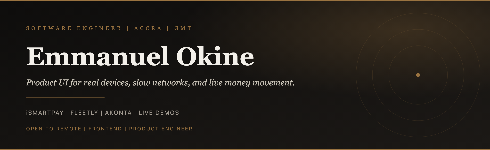
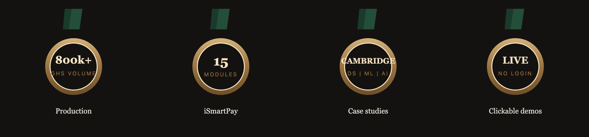

  

 

  
  
  

 

  

**I ship payment flows, fleet dashboards, and product interfaces that hold up on slow networks and real phones.**

Frontend lead on production fintech in Ghana. Live demos you can click through, no login required.

---

## Featured work

  
  
  

| Product | What it is | Proof |
| :--- | :--- | :--- |
| **[iSmartPay](https://emmanuel-okine.vercel.app/projects/ismartpay)** | Fintech platform, 15 modules, live money movement | 800k+ GHS processed · [try the demo](https://emmanuel-okine.vercel.app/projects/ismartpay) |
| **[Fleetly](https://emmanuel-okine.vercel.app/projects/fleetly)** | Fleet ops UI for operators, workshops, suppliers | 15+ modules shipped · [try the demo](https://emmanuel-okine.vercel.app/projects/fleetly) |
| **[Akonta](https://emmanuel-okine.vercel.app/projects/akonta)** | Offline first bookkeeping for market traders | EN / Twi · [try the demo](https://emmanuel-okine.vercel.app/projects/akonta) |

Data science case studies (forecasting, anomaly detection, NLP): [emmanuel-okine.vercel.app/data-science](https://emmanuel-okine.vercel.app/data-science)

Production work lives in private repos. The public proof is the portfolio: click around the actual product UI.

---

## Stack

  

 

`TypeScript` `React` `Next.js` `Vite` `Tailwind` `Zustand` `React Query` `Zod` `Vitest` `Sentry` `Node.js` `PostgreSQL` `Supabase` `Figma`

---

## GitHub

  

 

  
  

 

  

---

**Accra, Ghana (GMT / UTC+0)** · open to remote

[emmanuel-okine.vercel.app](https://emmanuel-okine.vercel.app) · emmanuelokine452@gmail.com

